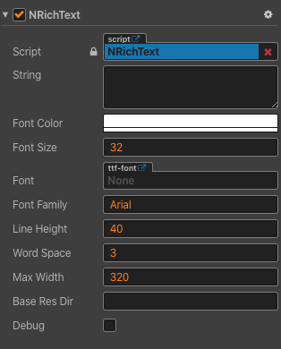
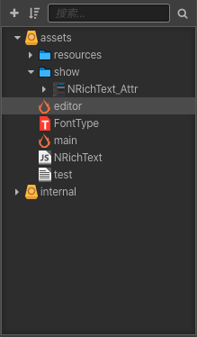
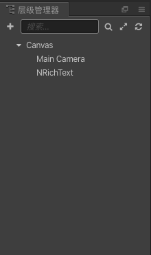
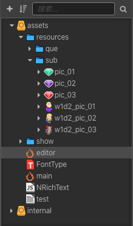
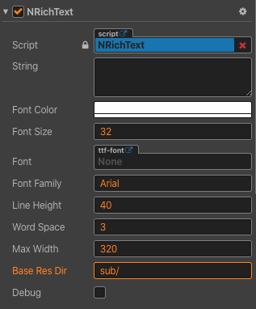
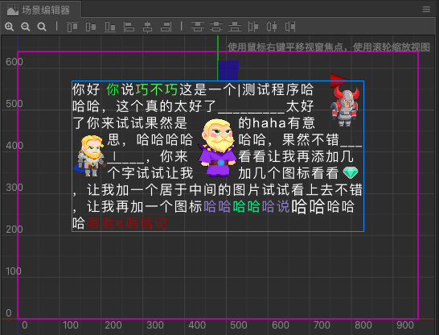

### NRichText富文本组件
NRichText富文本组件是一个用于Cocos Creator的富文本组件。

### 简介

NRichText 是一个用于 Cocos Creator 的富文本组件。因 Cocos Creator 的默认富文本组件的功能不能够完全实现数学游戏项目中的配置题目的需求，所以创建了这个组件。
NRichText 当前支持的特性有，自定义文字颜色，自定义字体大小，添加图标，添加文字环绕图片，添加截断图片，添加换行，添加分割线，添加输入框。
NRichText 对于当前数学项目中的丰富题目渲染将非常有用，将不断强化并扩充其功能，并将开发与之对应的可视化富文本编辑器，为项目提供更多便利。

### 认识组件
NRichText 组件与其他Cocos Creator渲染组件一样，只要挂载到节点上就可以使用。
NRichText 组件的属性面板如下图所示，其功能如下表所示。

| 序号 | 名称         | 用途                                            |
| --- | ------------ | ---------------------------------------------- |
| 1   | `string`     | 设置内容，富文本内容可设置到这里                    |
| 2   | `fontSize`   | 设置全局字体                                     | 
| 3   | `font`       | 设置使用图像字体                                  |  
| 4   | `fontFamily` | 设置系统字体名                                    | 
| 5   | `lineHeight` | 设置行高                                         |  
| 6   | `wordSpace`  | 设置单词间距                                      |  
| 7   | `maxWidth`   | 设置最大宽度                                      |  
| 8   | `baseResDir` | 设置富文本中用到的图片的基础路径，相对于resources文件夹 |  
| 9   | `debug`      | 设置是否开启调试模式                                |  

### 编辑规则

NRichText 的内容由**普通文本**和**标记**共同构成。

#### 标记书写方法

NRichText 中标记使用`[!tagname ]`这样的样式来书写，如果标记带有内容，则使用`[!tagname ]\(content\)`这样的格式书写。

#### 标记的详细介绍

##### `[!settings ]`

全局设置标记，用于设置一些应用于富文本组件整体的内容。
`[!settings ]` 可以设置几个属性，如下表所示。

| 序号 | 属性         | 用途                       | 默认值                 | 使用实例                       |
| ---- | ------------ | -------------------------- | ---------------------- | ------------------------------ |
| 1    | `color`      | 设置全局文字颜色           | 默认使用组件上设置的值 | `[!settings color=#ff9977]`    |
| 2    | `width`      | 设置文本框最大宽度         | 默认使用组件上设置的值 | `[!settings width=700]`        |
| 3    | `lineHeight` | 设置行高                   | 默认使用组件上设置的值 | `[!settings lineHeight =40]`   |
| 4    | `wordSpace`  | 设置文字间距               | 默认使用组件上设置的值 | `[!settings wordSpace =3]`     |
| 5    | `fontSize`   | 设置字体大小               | 默认使用组件上设置的值 | `[!settings fontSize =38]`     |
| 6    | `debug`      | 设置是否开启调试           | 默认使用组件上设置的值 | `[!settings debug =true]`      |
| 7    | `autoFocus`  | 设置输入框是否自动获取焦点 | 默认为true自动获取焦点       | `[!settings autoFocus =false]` |

##### `[!color #ffaa11](content)`

颜色标记，设置内容的颜色。需要设置的内容需放在`content`所在的部分，`content`中可以包含其他类型的标记。

##### `[!size 50](content)`

文字大小标记，设置内容的字体大小。需要设置的内容需放在`content`所在的部分，`content`中可以包含其他类型的标记。

##### `[!br ]`
换行标记，用来进行换行。

##### `[!icon ](content)`
图标，用来设置一个跟随文字顺序出现的图标，`content`为图标地址，其中中不能包含其他类型的标记，可以为图标设置一些属性如下表所示。

| 序号 | 属性          | 用途                        | 默认值                 | 使用实例                     |
| ---- | ------------ | -------------------------- | ---------------------- | -------------------------  |
| 1    | `hSpace`     | 设置图标水平方向左右两边的留白  | 默认0，单位是像素         | `[!icon hSpace=0]()`     |
| 2    | `align`      | 设置图标垂直方向上的对齐方式，可以设置（center，top，bottom）| 默认值 center           | `[!icon align=center]()` |
| 3    | `h`          | 设置图标的高度               | 默认值使用图片自身高度       | `[!icon h=30]()`       |
| 4    | `w`          | 设置图标的宽度               | 默认值使用图片自身宽度       | `[!icon w=30]()`       |

##### `[!divider ](content)`
分割线，用来设置一条分割线，`content`为一小块分割线的地址，其中中不能包含其他类型的标记，可以为分割线设置一些属性如下表所示。

| 序号 | 属性          | 用途                        | 默认值                 | 使用实例                     |
| ---- | ------------ | -------------------------- | ---------------------- | -------------------------  |
| 1    | `gap`        | 设置分割线小块间的间距         | 默认0，单位是像素         | `[!divider gap=0]()`     |
| 2    | `align`      | 设置图标垂直方向上的对齐方式，可以设置（0-1），0为在行的地步，1为在行的顶部| 默认值 0.5 居中           | `[!divider align=0.3]()` |
| 3    | `h`          | 设置分割线小块的高度           | 默认值使用图片自身高度       | `[!divider h=30]()`       |
| 4    | `w`          | 设置分割线小块的宽度           | 默认值使用图片自身宽度       | `[!divider w=30]()`       |

##### `[!img ](content)`
图片，用来显示一个图片，`content`为图片地址，其中中不能包含其他类型的标记，可以为图片设置一些属性如下表所示。

| 序号 | 属性          | 用途                        | 默认值                 | 使用实例                     |
| ---- | ------------ | -------------------------- | ---------------------- | -------------------------  |
| 1    | `hSpace`     | 设置图片水平方向左右两边的留白  | 默认0，单位是像素         | `[!img hSpace=0]()`     |
| 2    | `align`      | 设置图片水平方向上的对齐方式，可以设置（center，left，right）| 默认值 center           | `[!img align=center]()` |
| 3    | `h`          | 设置图片的高度                | 默认值使用图片自身高度       | `[!img h=30]()`       |
| 4    | `w`          | 设置图片的宽度                | 默认值使用图片自身宽度       | `[!img w=30]()`       |
| 5    | `type`        | 设置图片的类型（可以设置surround文字环绕图片，文字环绕图片会占用空间，文字环绕在其周围，block截断型图片，截断图片在图片前后会换行）| 默认值为block       | `[!img type=surround]()`       |
| 6    | `startLine`   | 设置图片的起始行，type为surround时进行设置  | 默认值为0       | `[!img startLine=30]()` |

##### `[!input ](content)`
输入框，用来显示一个输入框，`content`为输入框下划线，其中不能包含其他类型的标记，可以为输入框设置一些属性，如下表所示。

| 序号 | 属性          | 用途                        | 默认值                 | 使用实例                     |
| ---- | ------------ | -------------------------- | ---------------------- | -------------------------  |
| 1    | `id`         | 输入框ID                    | 必须设置，用于在控制输入   | `[!input id=input1]()`     |
| 2    | `color`      | 输入框光标颜色            | 默认采用输入框在文档流当前位置的颜色| `[!input color=#789f89]()`|
| 3    | `focus`      | 是否默认获取焦点            | 默认false                | `[!input focus=focus]()`|

##### 其他
因为英文的`[、]、(、)` 作为标记的识别符号已被占用，如要在内容中使用相应的符号，需要在符号前添加转义符号`\`，例如要想显示英文符号`(`则需要使用`\(`。

### 编辑预览方法
想要实时编辑并预览富文本内容，可以采用以下步骤。
1. 将本项目下载到本地
2. 使用Cocos Creator 2.1.3 打开本项目
3. 在左侧下方的资源管理器中，双击editor这个场景

4. 在左侧上方层级管理器中，单击选中`NRichText`这个节点

5. 在编辑器右侧可以看到`NRichText`的属性面板

6. 如需在富文本内容中显示图片，则需设置`baseResDir`，需要用到的图片需要放到resources中，例如想使用`sub`文件夹中的图片，则需要设置`baseResDir`为`sub/`

7.将富文本内容输入到`string`这个属性中，显示结果将实时刷新显示在场景编辑器中，如下图所示

### 如何在项目中使用
持续更新中...

### 扩充计划

持续更新中...

